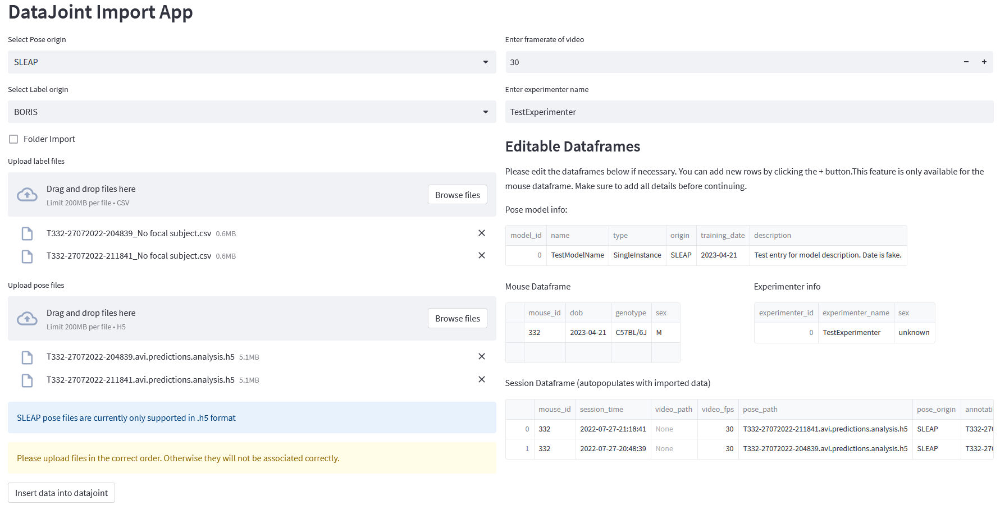

Repo to test datajoint functionality with lab pipeline

# New
- Added simple streamlit app to import data into the pipeline (work in progress)


# Installation
``pip install -r requirements.txt``

# Setup of database
For standard setup, follow the instructions on the [datajoint website](http://datajoint.github.io/datajoint-python/).
Set up the mysql database using docker. Then run the following commands after starting the container:

```python
import datajoint as dj

dj.config['database.host'] = '127.0.0.1'
dj.config['database.user'] = 'root'
dj.config['database.password'] = 'simple'
```
# Streamlit app for data import


To run the streamlit app, run the following command in the terminal:

``cd Datajoint_test``

then:

``streamlit run app.py``

# Datajoint pipeline
The datajoint schema and tables are defined in the file ``tables.py``. The pipeline is based on the [tutorial](http://datajoint.github.io/datajoint-python/) and datajoint tutorials.

- ``tables.py``: contains the schema and tables
- ``utils\load_data.py``: contains functions to load data into the pipeline
- ``utils\analysis.py``: contains functions to analyze data in the pipeline


# Data
The data is stored locally, but the pipeline can be adapted to use data from different sources.

# License
This project is licensed under the terms of the MIT license.